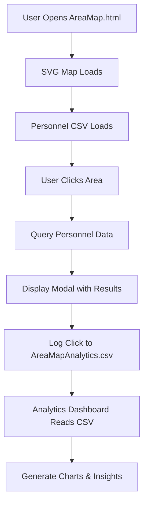

# System Architecture

## 🏗️ Overview

The SharePoint Interactive Area Map is a comprehensive system that combines interactive geographic visualization with personnel management and analytics tracking. The system operates entirely within SharePoint using client-side technologies.

## 🔄 Data Flow Architecture



## 📂 File Dependencies

### Core Application Files
```
AreaMap.html
├── Loads → Artboard 1.svg (Interactive map)
├── Reads → personnel_data.csv (Personnel information)
├── Writes → AreaMapAnalytics.csv (Usage tracking)
└── Stores → localStorage (Backup analytics)
```

### Analytics System
```
analytics-dashboard.html
├── Reads → AreaMapAnalytics.csv (Primary data source)
├── Reads → localStorage (Fallback data)
└── Generates → Charts & Statistics
```

## 🔧 Technical Architecture

### Frontend Components

#### 1. Interactive Map Engine
- **Technology**: SVG + JavaScript
- **Purpose**: Visual area selection interface
- **Features**: 
  - Click detection on geographic areas
  - Visual feedback (hover, selection)
  - Area code to region mapping

#### 2. Personnel Query System
- **Technology**: Client-side CSV parsing
- **Purpose**: Dynamic personnel lookup
- **Features**:
  - Primary/secondary area assignments
  - Coverage type filtering
  - Manager relationship display

#### 3. Analytics Tracking Engine
- **Technology**: JavaScript + LocalStorage + CSV
- **Purpose**: Usage monitoring and insights
- **Features**:
  - Automatic click logging
  - Session tracking
  - Timestamp recording

#### 4. Dashboard Visualization
- **Technology**: Chart.js + JavaScript
- **Purpose**: Data visualization and insights
- **Features**:
  - Time-based analysis
  - Interactive charts
  - Multiple view options

## 🗄️ Data Architecture

### Personnel Data Schema
```csv
Title,UserEmail,UserDisplayName,FirstName,LastName,PreferredFirstName,
UserDepartment,UserJobTitle,PrimaryAreaIDs,SecondaryAreaIDs,
ManagerDisplayName,ManagerEmail,ManagerDepartment,ManagerJobTitle
```

### Analytics Data Schema
```csv
Timestamp,Date,Time,AreaCode,AreaName,Region,SessionId,UserAgent,URL
```

### Area Mapping Structure
```javascript
{
  'A1': 'Baltimore Coast',    // East Region
  'B1': 'Chicago',           // Central Region  
  'C1': 'Denver'             // West Region
}
```

## 🔐 Security Architecture

### Access Control
- **Public Access**: AreaMap.html (end users)
- **Admin Access**: analytics-dashboard.html (administrators only)
- **File Permissions**: AreaMapAnalytics.csv (read/write for app, read-only for users)

### Data Privacy
- **Anonymous Tracking**: No personal data in analytics
- **Session-based IDs**: Temporary identifiers only
- **Local Storage**: Browser-based temporary storage

## 🚀 Performance Architecture

### Client-Side Processing
- **CSV Parsing**: Local processing for fast response
- **Map Rendering**: SVG for scalable graphics
- **Chart Generation**: Dynamic visualization

### Caching Strategy
- **Browser Cache**: Static resources (SVG, CSS)
- **LocalStorage**: Analytics backup
- **SharePoint Cache**: File-level caching

## 🔄 Integration Points

### SharePoint Integration
```javascript
// REST API for file operations
/_api/web/getfilebyserverrelativeurl('path')/value
```

### External Dependencies
- **Chart.js**: Analytics visualization
- **Browser APIs**: File reading, LocalStorage
- **SharePoint APIs**: File writing, authentication

## 📊 Scalability Considerations

### Data Volume
- **Personnel Records**: Supports 1000+ employees
- **Analytics Data**: Automatic rotation after 1000 entries
- **Geographic Areas**: 50+ defined regions

### Performance Optimization
- **Lazy Loading**: Charts load on demand
- **Data Chunking**: Large datasets processed in batches
- **Memory Management**: Automatic cleanup of old chart instances

## 🔧 Configuration Points

### Customizable Elements
1. **Area Definitions**: Geographic boundaries and codes
2. **Personnel Schema**: Additional fields and relationships
3. **Analytics Retention**: Data storage duration
4. **Visual Styling**: Colors, fonts, and layout

### Environment Variables
- **SharePoint Context**: `_spPageContextInfo`
- **File Paths**: Relative to deployment location
- **Debug Mode**: Console logging levels

## 🎯 Design Principles

### User Experience
- **Intuitive Navigation**: Click-based interaction
- **Immediate Feedback**: Real-time responses
- **Progressive Enhancement**: Works without JavaScript (basic functionality)

### Maintainability
- **Modular Code**: Separate concerns
- **Clear Documentation**: Inline comments
- **Error Handling**: Graceful degradation

### Reliability
- **Fallback Mechanisms**: Multiple data sources
- **Error Recovery**: Automatic retry logic
- **Data Integrity**: Validation and sanitization

---

*This architecture supports a scalable, maintainable, and secure interactive mapping solution for SharePoint environments.*