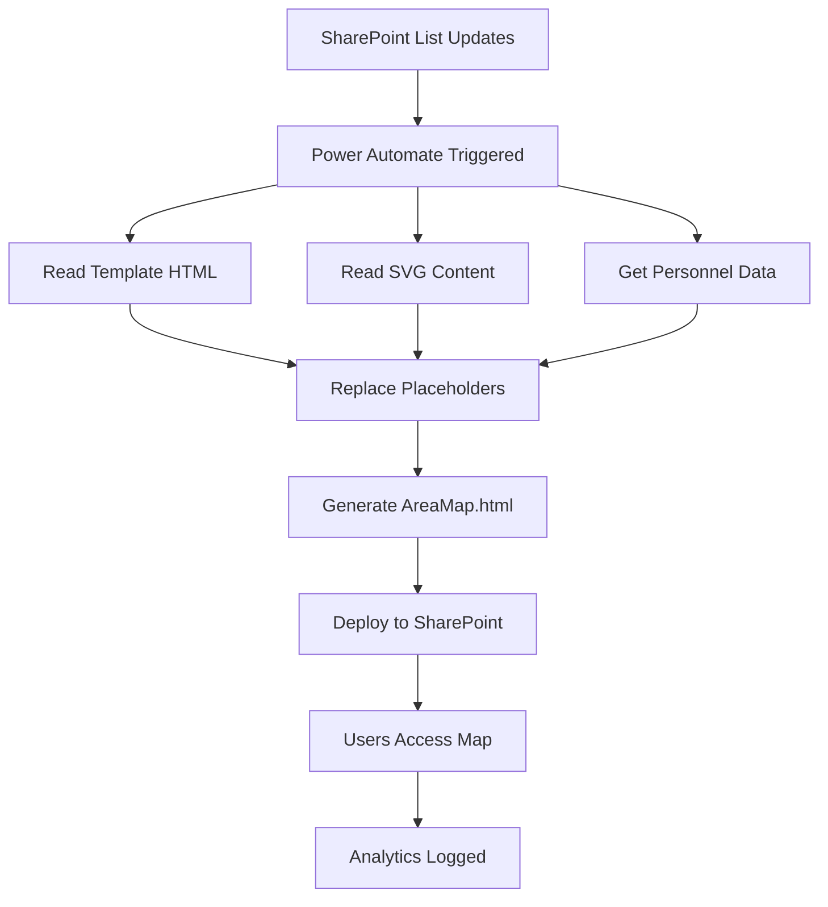

# System Architecture

## 🏗️ Overview

The SharePoint Interactive Area Map uses a **lock-and-key template system** to work within SharePoint's dependency restrictions. Power Automate assembles a self-contained HTML file by injecting SVG content and personnel data into a template, creating a fully functional application without external dependencies.

## 🔄 Lock-and-Key Architecture



## 📂 File Dependencies

### Template System Files
```
AreaMap-PowerAutomate-Template.html (Lock)
├── {{SVG_CONTENT}} → Embedded from Artboard 1-3.svg
├── {{PERSONNEL_DATA}} → Injected from SharePoint List
├── {{AREA_NAMES}} → Updated mappings (A08, C08)
└── All CSS/JS inline → No external dependencies

Power Automate Flow (Key)
├── Reads → Template + SVG + Personnel Data
├── Processes → Placeholder replacement
├── Outputs → AreaMap.html (self-contained)
└── Triggers → On SharePoint list change
```

### Analytics System
```
analytics-dashboard.html
├── Reads → AreaMapAnalytics.csv (Primary data source)
├── Reads → localStorage (Fallback data)
└── Generates → Charts & Statistics
```

## 🔧 Technical Architecture

### Template Components

#### 1. Template Placeholders
- **{{SVG_CONTENT}}**: Complete SVG map with grouped areas
- **{{PERSONNEL_DATA}}**: JSON array from SharePoint list
- **{{TITLE}}**: Page title configuration
- **{{ANALYTICS_FUNCTION}}**: Optional analytics code

#### 2. Grouped Area Support
- **New Areas**: A08 (Atlanta), C08 (Central Texas)
- **Renamed**: B05 (Minneapolis, was North Central)
- **Grouped Paths**: A04, B05, C06 handle multiple SVG paths
- **Click Handler**: Automatically highlights all paths in group

#### 3. Inline Architecture
- **CSS**: All styles embedded in `<style>` tags
- **JavaScript**: Complete functionality inline
- **SVG**: Entire map embedded in HTML
- **Data**: Personnel array injected directly

#### 4. Power Automate Integration
- **Trigger**: SharePoint list changes or scheduled
- **Actions**: Read files, transform data, write HTML
- **Output**: Self-contained HTML file
- **Deployment**: Direct to SharePoint document library

## 🗄️ Data Architecture

### Personnel Data Schema
```csv
Title,UserEmail,UserDisplayName,FirstName,LastName,PreferredFirstName,
UserDepartment,UserJobTitle,PrimaryAreaIDs,SecondaryAreaIDs,
ManagerDisplayName,ManagerEmail,ManagerDepartment,ManagerJobTitle
```

### Analytics Data Schema
```csv
Timestamp,Date,Time,AreaCode,AreaName,Region,SessionId,UserAgent,URL
```

### Area Mapping Structure
```javascript
// Updated for new SVG with 24 total areas
{
  // East Region (8 areas)
  'A01': 'Baltimore Coast',
  'A02': 'Raleigh',         // NEW (was South East)
  'A03': 'New England',
  'A04': 'New York',        // Has grouped paths
  'A05': 'Philadelphia',
  'A06': 'Gulf Coast',
  'A07': 'Florida',
  'A08': 'Atlanta',         // NEW
  
  // Central Region (8 areas)
  'B01': 'Chicago',
  'B02': 'Michigan',
  'B03': 'Ohio Valley',
  'B04': 'Central Plains',
  'B05': 'Minneapolis',     // RENAMED, has grouped paths
  'B06': 'Nashville',
  'B07': 'St. Louis',
  'B08': 'Tulsa',
  
  // West Region (8 areas)
  'C01': 'Denver',
  'C02': 'Dallas',
  'C03': 'Houston',
  'C04': 'Phoenix',
  'C05': 'Northern California',
  'C06': 'Seattle',         // May have grouped paths
  'C07': 'Los Angeles',
  'C08': 'Central Texas'    // NEW
}
```

## 🔐 Security Architecture

### Access Control
- **Public Access**: AreaMap.html (end users)
- **Admin Access**: analytics-dashboard.html (administrators only)
- **File Permissions**: AreaMapAnalytics.csv (read/write for app, read-only for users)

### Data Privacy
- **Anonymous Tracking**: No personal data in analytics
- **Session-based IDs**: Temporary identifiers only
- **Local Storage**: Browser-based temporary storage

## 🚀 Performance Architecture

### Client-Side Processing
- **CSV Parsing**: Local processing for fast response
- **Map Rendering**: SVG for scalable graphics
- **Chart Generation**: Dynamic visualization

### Caching Strategy
- **Browser Cache**: Static resources (SVG, CSS)
- **LocalStorage**: Analytics backup
- **SharePoint Cache**: File-level caching

## 🔄 Integration Points

### SharePoint Integration
```javascript
// REST API for file operations
/_api/web/getfilebyserverrelativeurl('path')/value
```

### External Dependencies
- **Chart.js**: Analytics visualization
- **Browser APIs**: File reading, LocalStorage
- **SharePoint APIs**: File writing, authentication

## 📊 Scalability Considerations

### Data Volume
- **Personnel Records**: Supports 1000+ employees
- **Analytics Data**: Automatic rotation after 1000 entries
- **Geographic Areas**: 50+ defined regions

### Performance Optimization
- **Lazy Loading**: Charts load on demand
- **Data Chunking**: Large datasets processed in batches
- **Memory Management**: Automatic cleanup of old chart instances

## 🔧 Configuration Points

### Customizable Elements
1. **Area Definitions**: Geographic boundaries and codes
2. **Personnel Schema**: Additional fields and relationships
3. **Analytics Retention**: Data storage duration
4. **Visual Styling**: Colors, fonts, and layout

### Environment Variables
- **SharePoint Context**: `_spPageContextInfo`
- **File Paths**: Relative to deployment location
- **Debug Mode**: Console logging levels

## 🎯 Design Principles

### User Experience
- **Intuitive Navigation**: Click-based interaction
- **Immediate Feedback**: Real-time responses
- **Progressive Enhancement**: Works without JavaScript (basic functionality)

### Maintainability
- **Modular Code**: Separate concerns
- **Clear Documentation**: Inline comments
- **Error Handling**: Graceful degradation

### Reliability
- **Fallback Mechanisms**: Multiple data sources
- **Error Recovery**: Automatic retry logic
- **Data Integrity**: Validation and sanitization

---

*This architecture supports a scalable, maintainable, and secure interactive mapping solution for SharePoint environments.*