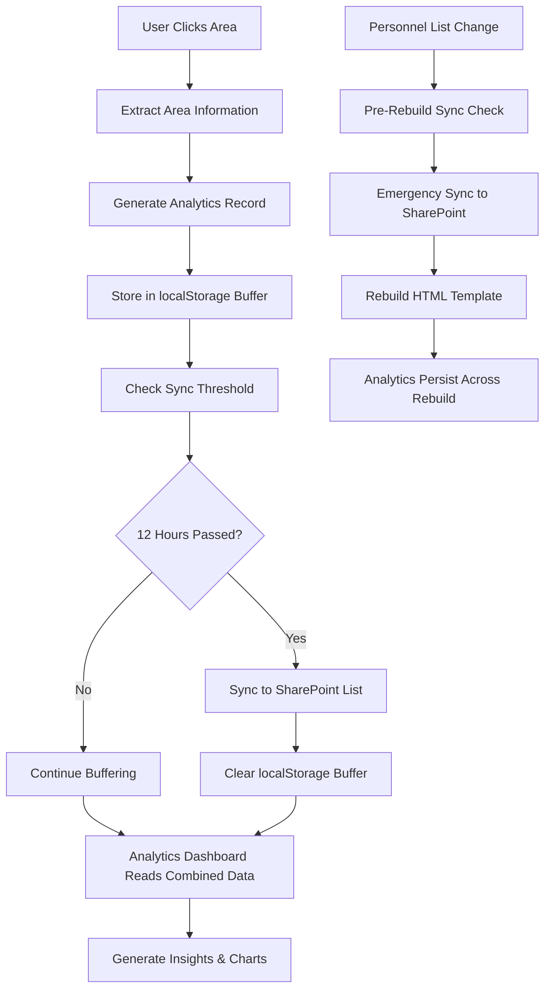

# Analytics System Documentation

## 📊 Overview

The Analytics System provides comprehensive usage tracking with a robust persistence strategy that survives HTML rebuilds. Using a hybrid storage approach with SharePoint list persistence and localStorage buffering, all analytics data is preserved when the template system regenerates AreaMap.html.

## 🔄 Enhanced Data Collection Flow



## 📋 Analytics Data Schema

### SharePoint Analytics List Structure
The primary storage is a SharePoint list called "AreaMapAnalytics" with the following columns:

| Column | Type | Required | Description |
|--------|------|----------|-------------|
| `Title` | Single line of text | Yes | Auto-generated title for click record |
| `ClickTimestamp` | Date and Time | Yes | Full timestamp of area click |
| `AreaCode` | Single line of text | Yes | Area identifier (A01, B05, C08, etc.) |
| `AreaName` | Single line of text | Yes | Human-readable area name |
| `Region` | Choice | Yes | Geographic region (East, Central, West) |
| `SessionId` | Single line of text | No | Browser session identifier |
| `UserAgent` | Multiple lines of text | No | Browser and device information |
| `PageURL` | Hyperlink or Picture | No | URL where click occurred |
| `ClickDate` | Date Only | Yes | Date portion for indexing and queries |
| `ClickHour` | Number | Yes | Hour (0-23) for hourly analysis |

### localStorage Buffer Structure
```json
{
  "id": "click_1705317000_abc123",
  "timestamp": "2024-01-15T10:30:00.000Z",
  "date": "2024-01-15",
  "time": "10:30:00",
  "hour": 10,
  "areaCode": "A08",
  "areaName": "Atlanta",
  "region": "East",
  "sessionId": "session_1705317000_def456",
  "userAgent": "Mozilla/5.0...",
  "url": "https://site.sharepoint.com/..."
}

## 🔧 Persistence Strategy Implementation

### Hybrid Storage Architecture
The analytics system uses a three-tier approach to ensure data survival across template rebuilds:

1. **Primary Storage**: SharePoint Analytics List (permanent)
2. **Secondary Storage**: localStorage Buffer (fast, 12-hour cycles)
3. **Tertiary Storage**: CSV Export (backup compatibility)

### Enhanced Analytics Function
```javascript
const ANALYTICS_CONFIG = {
    maxLocalStorage: 1000,
    syncInterval: 12 * 60 * 60 * 1000, // 12 hours
    lastSyncKey: 'areaMapLastSync',
    pendingDataKey: 'areaMapPendingClicks',
    sharePointListName: 'AreaMapAnalytics',
    siteUrl: '{{SITE_URL}}' // Power Automate placeholder
};

function logAreaClick(areaCode, areaName, region) {
    const clickData = {
        id: generateClickId(),
        timestamp: new Date().toISOString(),
        date: new Date().toISOString().split('T')[0],
        time: new Date().toTimeString().split(' ')[0],
        hour: new Date().getHours(),
        areaCode: areaCode,
        areaName: areaName,
        region: region,
        sessionId: generateSessionId(),
        userAgent: navigator.userAgent,
        url: window.location.href
    };
    
    addToLocalBuffer(clickData);
    checkSyncThreshold();
    
    // Optional custom analytics code
    {{ANALYTICS_FUNCTION}}
}
```

### Grouped Areas Handling
```javascript
// Analytics logs the base area code, not individual paths
function handleAreaClick(event) {
    const pathId = event.target.getAttribute('id');
    const areaMatch = pathId.match(/^([A-C]\d{2})/);
    const areaCode = areaMatch[1];  // A04 for both A04_NewYork and A04_NewYork-2
    
    // Log once per area, not per path
    logAreaClick(areaCode, areaName, region);
}
```

### Session ID Generation
```javascript
function generateSessionId() {
    return 'session_' + Date.now() + '_' + Math.random().toString(36).substr(2, 9);
}
```

### CSV File Writing Logic
```javascript
function writeToCSVFile(clickData) {
    const csvRow = [
        clickData.timestamp,
        clickData.date,
        clickData.time,
        clickData.areaCode,
        clickData.areaName.replace(/,/g, ';'), // Escape commas
        clickData.region,
        clickData.sessionId,
        `"${clickData.userAgent.replace(/"/g, '""')}"`, // Escape quotes
        clickData.url
    ].join(',');
    
    // Append to AreaMapAnalytics.csv
    appendToMasterCSV(csvRow);
}
```

## 📁 Multi-Tier Storage Strategy

### Primary Storage: SharePoint Analytics List
- **List Name**: AreaMapAnalytics
- **Location**: Same SharePoint site as Personnel list
- **Persistence**: Permanent, survives HTML rebuilds
- **Access**: Power Automate read/write, frontend sync access
- **Capacity**: Enterprise-scale (millions of records)

### Secondary Storage: localStorage Buffer
- **Purpose**: Fast local buffer for immediate click capture
- **Capacity**: 1000 items max (auto-rotation)
- **Sync Frequency**: Every 12 hours or before rebuild
- **Management**: Automatic cleanup after successful sync

### Local Buffer Implementation
```javascript
function addToLocalBuffer(clickData) {
    try {
        let pendingClicks = JSON.parse(localStorage.getItem(ANALYTICS_CONFIG.pendingDataKey) || '[]');
        pendingClicks.push(clickData);
        
        if (pendingClicks.length > ANALYTICS_CONFIG.maxLocalStorage) {
            syncToSharePoint();
        } else {
            localStorage.setItem(ANALYTICS_CONFIG.pendingDataKey, JSON.stringify(pendingClicks));
        }
    } catch (error) {
        console.error('Error adding to local buffer:', error);
    }
}

function checkSyncThreshold() {
    const lastSync = localStorage.getItem(ANALYTICS_CONFIG.lastSyncKey);
    const now = Date.now();
    
    if (!lastSync || (now - parseInt(lastSync)) > ANALYTICS_CONFIG.syncInterval) {
        syncToSharePoint();
    }
}
```

## 🔒 SharePoint List Integration

### Sync to SharePoint Implementation
```javascript
async function syncToSharePoint() {
    try {
        const pendingClicks = JSON.parse(localStorage.getItem(ANALYTICS_CONFIG.pendingDataKey) || '[]');
        
        if (pendingClicks.length === 0) return;
        
        console.log(`Syncing ${pendingClicks.length} clicks to SharePoint...`);
        
        if (typeof _spPageContextInfo !== 'undefined') {
            await batchUploadToSharePoint(pendingClicks);
            localStorage.removeItem(ANALYTICS_CONFIG.pendingDataKey);
            localStorage.setItem(ANALYTICS_CONFIG.lastSyncKey, Date.now().toString());
            console.log('✅ Analytics sync completed');
        } else {
            console.warn('SharePoint context not available - keeping data for later sync');
        }
        
    } catch (error) {
        console.error('❌ Analytics sync failed:', error);
    }
}

async function batchUploadToSharePoint(clicksArray) {
    const url = `${ANALYTICS_CONFIG.siteUrl}/_api/web/lists/getbytitle('${ANALYTICS_CONFIG.sharePointListName}')/items`;
    
    for (const click of clicksArray) {
        const itemData = {
            '__metadata': { 'type': 'SP.Data.AreaMapAnalyticsListItem' },
            'Title': `Click-${click.areaCode}-${click.timestamp}`,
            'ClickTimestamp': click.timestamp,
            'AreaCode': click.areaCode,
            'AreaName': click.areaName,
            'Region': click.region,
            'SessionId': click.sessionId,
            'UserAgent': click.userAgent,
            'PageURL': click.url,
            'ClickDate': click.date,
            'ClickHour': click.hour
        };
        
        await fetch(url, {
            method: 'POST',
            headers: {
                'Accept': 'application/json;odata=verbose',
                'Content-Type': 'application/json;odata=verbose',
                'X-RequestDigest': document.getElementById('__REQUESTDIGEST').value
            },
            body: JSON.stringify(itemData)
        });
    }
}
```

### Pre-Rebuild Data Preservation
```javascript
// Auto-sync before page unload
window.addEventListener('beforeunload', function() {
    const pendingClicks = JSON.parse(localStorage.getItem(ANALYTICS_CONFIG.pendingDataKey) || '[]');
    if (pendingClicks.length > 0) {
        // Emergency sync attempt
        syncToSharePoint();
    }
});

// Initialize sync check on page load
document.addEventListener('DOMContentLoaded', function() {
    checkSyncThreshold();
});
```

### Power Automate Integration
The Personnel list change trigger includes a pre-action to sync analytics:

```json
{
  "trigger": {
    "type": "sharePointListModified",
    "listName": "Personnel",
    "preActions": ["syncPendingAnalytics"]
  },
  "actions": [
    {
      "step": 1,
      "action": "syncAnalyticsToSharePoint",
      "description": "Save any pending analytics before rebuild"
    },
    {
      "step": 2,
      "action": "rebuildAreaMapTemplate",
      "description": "Generate new HTML with updated personnel data"
    }
  ]
}
```

## 📊 Analytics with New Areas

### Updated Geographic Tracking
- **24 Total Areas**: 8 per region (East, Central, West)
- **New Areas**: A08 (Atlanta), C08 (Central Texas)
- **Renamed Areas**: B05 (Minneapolis, was North Central)
- **Grouped Areas**: A04, B05, C06 tracked as single units

### Enhanced Regional Insights
- **East Region**: A01-A08 (Baltimore Coast to Atlanta)
- **Central Region**: B01-B08 (Chicago to Tulsa)
- **West Region**: C01-C08 (Denver to Central Texas)

### Grouped Area Analytics
```javascript
// Track grouped areas as single entities
function getAreaGroup(pathId) {
    return pathId.match(/^([A-C]\d{2})/)[1];  // Returns A04, B05, etc.
}

// Analytics aggregates all clicks for grouped paths
const groupedClicks = analyticsData.filter(click => 
    click.AreaCode === 'A04'  // Includes both A04_NewYork and A04_NewYork-2
);
```

## 🔄 Data Processing Pipeline

### Data Aggregation
```javascript
function aggregateAnalytics(rawData) {
    const analytics = {
        totalClicks: rawData.length,
        uniqueAreas: new Set(rawData.map(d => d.AreaName)).size,
        uniqueSessions: new Set(rawData.map(d => d.SessionId)).size,
        
        // Time-based aggregation
        hourlyDistribution: aggregateByHour(rawData),
        dailyTrends: aggregateByDay(rawData),
        weeklyPatterns: aggregateByWeek(rawData),
        
        // Geographic aggregation
        areaPopularity: aggregateByArea(rawData),
        regionalDistribution: aggregateByRegion(rawData)
    };
    
    return analytics;
}
```

### Data Export Functions
```javascript
function exportAnalyticsCSV() {
    const headers = ['Timestamp', 'Date', 'Time', 'AreaCode', 'AreaName', 'Region', 'SessionId'];
    let csvContent = headers.join(',') + '\\n';
    
    analyticsData.forEach(record => {
        csvContent += [
            record.timestamp,
            record.date,
            record.time,
            record.areaCode,
            record.areaName.replace(/,/g, ';'),
            record.region,
            record.sessionId
        ].join(',') + '\\n';
    });
    
    return csvContent;
}
```

## 🛡️ Privacy & Security

### Data Protection Measures
- **Anonymous Tracking**: No personal identifiable information collected
- **Session-based IDs**: Temporary identifiers only, not linked to users
- **Browser Information**: Limited to technical compatibility data
- **URL Logging**: Page context only, no sensitive parameters

### Access Control
- **Analytics File**: Admin read/write access only
- **Dashboard Access**: Restricted to authorized administrators
- **Data Retention**: Configurable retention policies
- **Audit Trail**: All access logged for security monitoring

### GDPR Compliance
- **Minimal Data**: Only necessary analytics data collected
- **Anonymization**: No personal data in analytics records
- **Right to Erasure**: Ability to purge analytics data
- **Data Purpose**: Clear business justification for collection

## 🔧 Configuration Options

### Analytics Settings
```javascript
const analyticsConfig = {
    // Data retention
    maxLocalStorageRecords: 1000,
    csvRetentionDays: 365,
    
    // Collection settings
    enableAnalytics: true,
    logUserAgent: true,
    logPageURL: true,
    
    // Export options
    csvDateFormat: 'YYYY-MM-DD',
    timestampFormat: 'ISO',
    
    // Performance settings
    batchSize: 100,
    retryAttempts: 3,
    retryDelay: 5000
};
```

### Environment Detection
```javascript
function getEnvironmentConfig() {
    if (typeof _spPageContextInfo !== 'undefined') {
        // SharePoint environment
        return {
            platform: 'SharePoint',
            apiAvailable: true,
            fileWriteMethod: 'REST_API'
        };
    } else {
        // Development/local environment
        return {
            platform: 'Local',
            apiAvailable: false,
            fileWriteMethod: 'SIMULATION'
        };
    }
}
```

## 📈 Performance Optimization

### Asynchronous Processing
- **Non-blocking Writes**: Analytics don't impact UI responsiveness
- **Background Processing**: File operations in separate thread
- **Batch Operations**: Group multiple writes for efficiency
- **Error Recovery**: Graceful handling of failed operations

### Memory Management
- **Automatic Cleanup**: Regular garbage collection of old data
- **Size Limits**: Prevent memory overflow with data caps
- **Lazy Loading**: Load analytics data only when needed
- **Cache Optimization**: Efficient data structure usage

### Network Optimization
- **Retry Logic**: Intelligent retry with exponential backoff
- **Compression**: Minimize data transfer size
- **Caching**: Reduce redundant API calls
- **Offline Support**: Queue operations when network unavailable

## 🔄 Analytics Dashboard Updates

### Data Source Priority
1. **Primary**: SharePoint Analytics List (complete historical data)
2. **Secondary**: localStorage Buffer (current session)
3. **Fallback**: CSV export (legacy compatibility)

### Dashboard Loading Logic
```javascript
async function loadAnalyticsData() {
    try {
        // Try SharePoint Analytics List first
        const sharePointData = await loadFromSharePointAnalytics();
        if (sharePointData && sharePointData.length > 0) {
            return sharePointData;
        }
        
        // Fallback to localStorage
        return loadFromLocalStorage();
        
    } catch (error) {
        console.error('Error loading analytics data:', error);
        return [];
    }
}

async function loadFromSharePointAnalytics() {
    const url = `${siteUrl}/_api/web/lists/getbytitle('AreaMapAnalytics')/items?$top=5000&$orderby=ClickTimestamp desc`;
    
    const response = await fetch(url, {
        headers: { 'Accept': 'application/json;odata=verbose' }
    });
    
    const data = await response.json();
    return data.d.results.map(item => ({
        timestamp: item.ClickTimestamp,
        areaCode: item.AreaCode,
        areaName: item.AreaName,
        region: item.Region,
        sessionId: item.SessionId,
        date: item.ClickDate,
        hour: item.ClickHour
    }));
}
```

## 🛡️ Data Safety Features

### Backup Strategies
1. **Real-time**: localStorage buffer (1000 items max)
2. **Periodic**: 12-hour sync to SharePoint list
3. **Pre-rebuild**: Emergency sync before template regeneration
4. **Cross-browser**: SharePoint persistence survives cache clears

### Error Handling
- Failed syncs keep data in localStorage for retry
- SharePoint list provides permanent fallback
- Data validation before upload prevents corruption
- Graceful degradation if SharePoint unavailable

### Performance Optimization
- Batch uploads (configurable size limits)
- Asynchronous processing (non-blocking UI)
- Local buffer prevents API overload
- Indexed SharePoint columns for fast queries

---

*The Enhanced Analytics System provides robust, rebuild-resistant usage tracking with enterprise-grade persistence and comprehensive backup strategies for reliable data collection.*