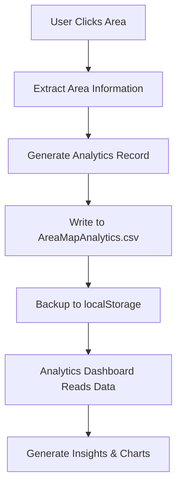

# Analytics System Documentation

## 📊 Overview

The Analytics System provides comprehensive usage tracking for the AreaMap application. It automatically captures user interactions, stores data in multiple formats, and enables detailed analysis of system usage patterns. The system operates transparently without requiring user intervention.

## 🔄 Data Collection Flow



## 📋 Analytics Data Schema

### Primary Data Structure
```csv
Timestamp,Date,Time,AreaCode,AreaName,Region,SessionId,UserAgent,URL
```

### Field Definitions

| Field | Type | Description | Example |
|-------|------|-------------|---------|
| `Timestamp` | ISO DateTime | Full timestamp with timezone | 2024-01-15T10:30:00.000Z |
| `Date` | Date | Date portion only | 2024-01-15 |
| `Time` | Time | Time portion only | 10:30:00 |
| `AreaCode` | String | Geographic area identifier | A1, B2, C3 |
| `AreaName` | String | Human-readable area name | Baltimore Coast |
| `Region` | String | Geographic region | East, Central, West |
| `SessionId` | String | Unique session identifier | session_1705317000_abc123 |
| `UserAgent` | String | Browser/device information | Mozilla/5.0... |
| `URL` | String | Page URL where click occurred | https://site.sharepoint.com/... |

## 🔧 Implementation Details

### Click Logging Function
```javascript
function logAreaClick(areaCode, areaName, region) {
    const clickData = {
        timestamp: new Date().toISOString(),
        date: new Date().toISOString().split('T')[0],
        time: new Date().toTimeString().split(' ')[0],
        areaCode: areaCode,
        areaName: areaName,
        region: region,
        sessionId: generateSessionId(),
        userAgent: navigator.userAgent,
        url: window.location.href
    };
    
    // Save to localStorage for analytics dashboard
    appendToLocalStorage(clickData);
    
    // Automatically write to CSV file (for admin use)
    writeToCSVFile(clickData);
    
    console.log('Click logged:', clickData);
}
```

### Session ID Generation
```javascript
function generateSessionId() {
    return 'session_' + Date.now() + '_' + Math.random().toString(36).substr(2, 9);
}
```

### CSV File Writing Logic
```javascript
function writeToCSVFile(clickData) {
    const csvRow = [
        clickData.timestamp,
        clickData.date,
        clickData.time,
        clickData.areaCode,
        clickData.areaName.replace(/,/g, ';'), // Escape commas
        clickData.region,
        clickData.sessionId,
        `"${clickData.userAgent.replace(/"/g, '""')}"`, // Escape quotes
        clickData.url
    ].join(',');
    
    // Append to AreaMapAnalytics.csv
    appendToMasterCSV(csvRow);
}
```

## 📁 Data Storage Strategy

### Primary Storage: AreaMapAnalytics.csv
- **Location**: Same directory as AreaMap.html
- **Format**: Standard CSV with headers
- **Access**: Admin read/write, application append
- **Persistence**: Permanent file-based storage

### Backup Storage: localStorage
- **Purpose**: Fallback and dashboard integration
- **Capacity**: Limited to ~5MB browser storage
- **Retention**: Browser-dependent (cleared on cache clear)
- **Management**: Automatic rotation after 1000 records

### Storage Implementation
```javascript
function appendToLocalStorage(clickData) {
    try {
        let clickLog = JSON.parse(localStorage.getItem('areaMapClickLog') || '[]');
        clickLog.push(clickData);
        
        // Keep only last 1000 records to prevent overflow
        if (clickLog.length > 1000) {
            clickLog = clickLog.slice(-1000);
        }
        
        localStorage.setItem('areaMapClickLog', JSON.stringify(clickLog));
    } catch (e) {
        console.log('Could not save to localStorage:', e);
    }
}
```

## 🔒 SharePoint Integration

### REST API Implementation
```javascript
function appendToSharePointCSV(csvUrl, csvRow) {
    // First, get the current CSV content
    fetch(csvUrl, {
        method: 'GET',
        headers: { 'Accept': 'text/plain' }
    })
    .then(response => response.text())
    .then(currentContent => {
        // Append new row
        const updatedContent = currentContent.trim() + '\\n' + csvRow;
        
        // Update the file using SharePoint REST API
        const fileUrl = _spPageContextInfo.webAbsoluteUrl + 
            "/_api/web/getfilebyserverrelativeurl('" + 
            csvUrl.replace(_spPageContextInfo.webAbsoluteUrl, '') + 
            "')/\\$value";
        
        return fetch(fileUrl, {
            method: 'POST',
            headers: {
                'Accept': 'application/json;odata=verbose',
                'X-RequestDigest': document.getElementById('__REQUESTDIGEST').value,
                'X-HTTP-Method': 'PUT',
                'Content-Type': 'text/plain'
            },
            body: updatedContent
        });
    })
    .then(response => {
        if (response.ok) {
            console.log('✅ Successfully appended to AreaMapAnalytics.csv');
        } else {
            console.error('❌ Failed to append to CSV:', response.statusText);
        }
    })
    .catch(error => {
        console.error('❌ Error appending to CSV:', error);
        storeForRetry(csvRow);
    });
}
```

### Error Handling & Retry Logic
```javascript
function storeForRetry(csvRow) {
    try {
        let failedWrites = JSON.parse(localStorage.getItem('failedCSVWrites') || '[]');
        failedWrites.push({
            timestamp: new Date().toISOString(),
            csvRow: csvRow
        });
        localStorage.setItem('failedCSVWrites', JSON.stringify(failedWrites));
        console.log('📝 Stored failed write for retry');
    } catch (e) {
        console.error('Failed to store for retry:', e);
    }
}
```

## 📊 Data Analytics Capabilities

### Real-time Metrics
- **Click Count**: Total area clicks across all sessions
- **Popular Areas**: Most frequently clicked geographic areas
- **Regional Distribution**: Click distribution across East/Central/West
- **Session Tracking**: Unique user sessions and engagement

### Time-based Analysis
- **Hourly Patterns**: Peak usage hours (0:00-23:00)
- **Daily Trends**: Day-over-day usage patterns
- **Weekly Cycles**: Weekly usage cycles
- **Monthly Reports**: Long-term usage trends

### Geographic Insights
- **Area Popularity**: Ranking of most accessed areas
- **Regional Balance**: Usage distribution across regions
- **Coverage Analysis**: Areas with high vs low engagement
- **Geographic Hotspots**: Identify areas of high interest

## 🔄 Data Processing Pipeline

### Data Aggregation
```javascript
function aggregateAnalytics(rawData) {
    const analytics = {
        totalClicks: rawData.length,
        uniqueAreas: new Set(rawData.map(d => d.AreaName)).size,
        uniqueSessions: new Set(rawData.map(d => d.SessionId)).size,
        
        // Time-based aggregation
        hourlyDistribution: aggregateByHour(rawData),
        dailyTrends: aggregateByDay(rawData),
        weeklyPatterns: aggregateByWeek(rawData),
        
        // Geographic aggregation
        areaPopularity: aggregateByArea(rawData),
        regionalDistribution: aggregateByRegion(rawData)
    };
    
    return analytics;
}
```

### Data Export Functions
```javascript
function exportAnalyticsCSV() {
    const headers = ['Timestamp', 'Date', 'Time', 'AreaCode', 'AreaName', 'Region', 'SessionId'];
    let csvContent = headers.join(',') + '\\n';
    
    analyticsData.forEach(record => {
        csvContent += [
            record.timestamp,
            record.date,
            record.time,
            record.areaCode,
            record.areaName.replace(/,/g, ';'),
            record.region,
            record.sessionId
        ].join(',') + '\\n';
    });
    
    return csvContent;
}
```

## 🛡️ Privacy & Security

### Data Protection Measures
- **Anonymous Tracking**: No personal identifiable information collected
- **Session-based IDs**: Temporary identifiers only, not linked to users
- **Browser Information**: Limited to technical compatibility data
- **URL Logging**: Page context only, no sensitive parameters

### Access Control
- **Analytics File**: Admin read/write access only
- **Dashboard Access**: Restricted to authorized administrators
- **Data Retention**: Configurable retention policies
- **Audit Trail**: All access logged for security monitoring

### GDPR Compliance
- **Minimal Data**: Only necessary analytics data collected
- **Anonymization**: No personal data in analytics records
- **Right to Erasure**: Ability to purge analytics data
- **Data Purpose**: Clear business justification for collection

## 🔧 Configuration Options

### Analytics Settings
```javascript
const analyticsConfig = {
    // Data retention
    maxLocalStorageRecords: 1000,
    csvRetentionDays: 365,
    
    // Collection settings
    enableAnalytics: true,
    logUserAgent: true,
    logPageURL: true,
    
    // Export options
    csvDateFormat: 'YYYY-MM-DD',
    timestampFormat: 'ISO',
    
    // Performance settings
    batchSize: 100,
    retryAttempts: 3,
    retryDelay: 5000
};
```

### Environment Detection
```javascript
function getEnvironmentConfig() {
    if (typeof _spPageContextInfo !== 'undefined') {
        // SharePoint environment
        return {
            platform: 'SharePoint',
            apiAvailable: true,
            fileWriteMethod: 'REST_API'
        };
    } else {
        // Development/local environment
        return {
            platform: 'Local',
            apiAvailable: false,
            fileWriteMethod: 'SIMULATION'
        };
    }
}
```

## 📈 Performance Optimization

### Asynchronous Processing
- **Non-blocking Writes**: Analytics don't impact UI responsiveness
- **Background Processing**: File operations in separate thread
- **Batch Operations**: Group multiple writes for efficiency
- **Error Recovery**: Graceful handling of failed operations

### Memory Management
- **Automatic Cleanup**: Regular garbage collection of old data
- **Size Limits**: Prevent memory overflow with data caps
- **Lazy Loading**: Load analytics data only when needed
- **Cache Optimization**: Efficient data structure usage

### Network Optimization
- **Retry Logic**: Intelligent retry with exponential backoff
- **Compression**: Minimize data transfer size
- **Caching**: Reduce redundant API calls
- **Offline Support**: Queue operations when network unavailable

---

*The Analytics System provides comprehensive, privacy-compliant usage tracking with robust data storage and real-time insights for informed decision-making.*